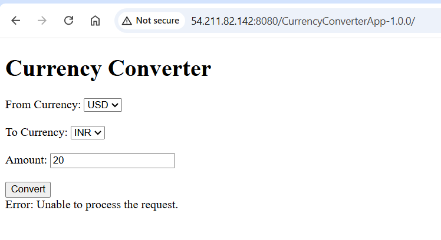
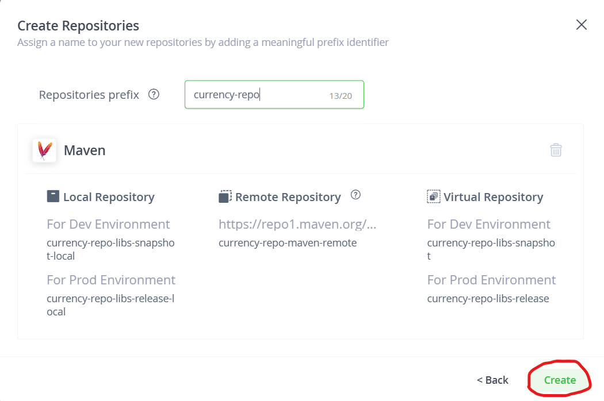

# CurrencyConverterApp
Here is the structure of file:

```css
CurrencyConverterApp/
├── build.xml
├── src/
│   ├── main/
│   │   ├── java/
│   │   │   └── com/
│   │   │       └── example/
│   │   │           └── currencyconverter/
│   │   │               └── CurrencyConverterServlet.java
│   │   ├── webapp/
│   │       ├── index.html
│   │       ├── WEB-INF/
│   │           ├── web.xml
│   │           └── result.jsp
├── lib/
│   └── jakarta.servlet-api-5.0.0.jar
```

### **_To build and deploy the Currency Converter application on Ubuntu, follow the steps below. This includes installing required tools, building the WAR package, and deploying it to Tomcat._**

#### Step 1: Install Java and Apache Ant
1. **Update Packages:**
```bash
sudo apt update
```
2. **Install Java (JDK 17)**
```bash
sudo apt install openjdk-17-jdk -y
```
3. **Verify Java Installation:**
```bash
java -version
```
4. **Install Apache Ant:**
```bash
sudo apt install ant -y
```
5. **Verify Ant Installation:**
```bash
ant -version
```
#### Step 2: Set Up the Project
1. **Clone the code**
```bash 
git clone https://github.com/AWS-DevOps-BasicS/CurrencyConverterApp.git
```
#### Step 3: Build the WAR File
1. **Navigate to the Project Directory:**
```bash
cd /home/username/CurrencyConverterApp
```
2. **Run the Build Command:**
```bash
ant clean
ant dist
```
3. **Verify the WAR File:**

* After the build, the WAR file will be created in the `dist` directory:
```bash
/home/username/CurrencyConverterApp/dist/CurrencyConverterApp.war
```
#### Step 4: Deploy to Tomcat
1. **Install tomcat:**
```bash
# in /home/ubuntu/
wget https://dlcdn.apache.org/tomcat/tomcat-9/v9.0.97/bin/apache-tomcat-9.0.97.tar.gz
tar -xvf apache-tomcat-9.0.97.tar.gz
```
2. **start the tomcat server**
```bash
cd apache-tomcat-9.0.97/bin
./startup.sh
```
3. **Copy the WAR File to Tomcat's `webapps` Directory:**
```bash
cp CurrencyConverterApp/dist/CurrencyConverterApp.war apache-tomcat-9.0.97/webapps/
```
4. **Check Deployment:**

* Open a browser and visit:
```
http://<server-ip>:8080/CurrencyConverterApp/
```


### JFrog Artifactory
* Taken ubuntu 22.04 and installed java 11
* Get the vesion from jfrog page [refer here](https://jfrog.com/download-legacy/)

```bash
sudo apt update
sudo apt install openjdk-11-jdk net-tools -y
wget https://releases.jfrog.io/artifactory/artifactory-pro-debs/pool/jfrog-artifactory-pro/jfrog-artifactory-pro-7.55.2.deb?_gl=1*1dq24qp*_gcl_aw*R0NMLjE3MzM4MTE3MzcuQ2owS0NRaUF4OXE2QmhDREFSSXNBQ3dVeHU3bGRGbkxGRXpTa0ZVeVRzWXo3bEI1Wmp2ZTFOdkwzeTdxT1dDTGVpTUJSdzBUVFpyYjd0WWFBa2JrRUFMd193Y0I.*_gcl_au*MTgzNjY2NTQ4NS4xNzMzODA2NjU4*FPAU*MTgzNjY2NTQ4NS4xNzMzODA2NjU4*_ga*MjAxNjE1MzE3NC4xNzE4MjY1Nzk3*_ga_SQ1NR9VTFJ*MTczMzgyMjYzMS4xMC4xLjE3MzM4MjI5NjMuMC4wLjE5NTIxNjU2MTc.*_fplc*S3RpOVB4NXZMdmxueDRkaDd0SndtJTJGWWMzZk8yJTJCaVY3V3dnejFLbWozUW9aeGdiUG5vJTJCMjd1em5ER1RoTmpRSmVOWVl5NVNpdkhQNmNUb1FUMWlmNkVicEZjUWNkVkx0cjd0Sk81Wm14TSUyQnBNdVpWa2d5SlhwN3ZFVGhMSHclM0QlM0Q.
mv 'jfrog-artifactory-pro-7.55.2.deb?_gl=1*1dq24qp*_gcl_aw*R0NMLjE3MzM4MTE3MzcuQ2owS0NRaUF4OXE2QmhDREFSSXNBQ3dVeHU3bGRGbkxGRXpTa0ZVeVRzWXo3bEI1Wmp2ZTFOdkwzeTdxT1dDTGVpTUJSdzBUVFpyYjd0WWFBa2JrRUFMd193Y0I.*_gcl_au*MTgzNjY2NTQ4NS4xNzMzODA2NjU4' jfrog-artifactory-pro-7.55.2.deb
sudo dpkg -i jfrog-artifactory-pro-7.55.2.deb
sudo systemctl start artifactory.service
sudo systemctl enable artifactory.service
sudo systemctl status artifactory.service
```

* Provide default admin username as **“admin”** and password as **“password”** then click on the Login button. You will see the Getting Started page.


* As of now try to use free trail- self hosted and get 30 days free trail where you get the license key 


* My build tool is ant but jfrog is not providing ant so I selected Generic repository.


* We can create the repository after login into the jfrog.





* Now, In build.xml file we have to add details of this repository of jfrog artifactory so while building the artifact that artifact will store in the jfrog artifactory.
* I tried to do the process with ant as build tool but jfrog is not supporting and involving maven. SO instead of that I will use maven as build tool.