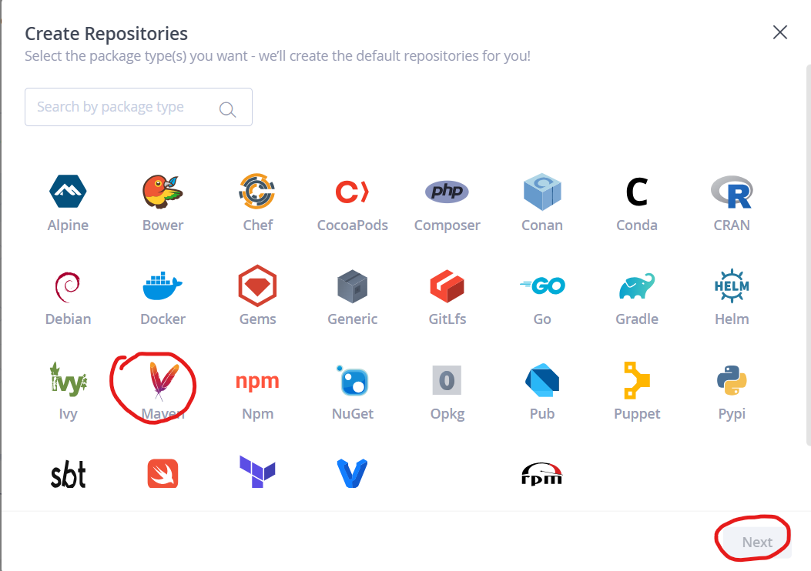

# CurrencyConverterApp
Here is the structure of file:

```css
CurrencyConverterApp/
├── pom.xml                       # Maven Project Object Model (POM) file
├── src/
│   └── main/
│       ├── java/
│       │   └── com/
│       │       └── example/
│       │           └── currencyconverter/
│       │               └── CurrencyConverterServlet.java  # Servlet for conversion logic
│       ├── resources/
│       │   └── META-INF/
│       │       └── context.xml  # GlassFish-specific configuration (optional)
│       └── webapp/
│           ├── WEB-INF/
│           │   ├── web.xml         # Web application configuration
│           │   └── glassfish-web.xml  # GlassFish-specific configuration (optional)
│           ├── index.html          # Main page with form for currency conversion
│           ├── result.html         # Page to display the conversion result
│           └── convert.js          # JavaScript to handle AJAX requests
└── target/
    └── CurrencyConverterApp.war  # WAR file generated after build

```

### **_To build and deploy the Currency Converter application on Ubuntu, follow the steps below. This includes installing required tools, building the WAR package, and deploying it to Tomcat._**

#### Step 1: Install Java and Apache Ant
1. **Update Packages:**
```bash
sudo apt update
```
2. **Install Java (JDK 17)**
```bash
sudo apt install openjdk-17-jdk -y
```
3. **Verify Java Installation:**
```bash
java -version
```
4. **Install maven:**
```bash
sudo apt install maven -y
```
5. **Verify Ant Installation:**
```bash
mvn -version
```
#### Step 2: Set Up the Project
1. **Clone the code**
```bash 
git clone https://github.com/AWS-DevOps-BasicS/Projects.git
```
#### Step 3: Build the WAR File
1. **Navigate to the Project Directory:**
```bash
cd Projects/CurrencyConverterApp
```
2. **Run the Build Command:**
```bash
mvn clean package
```
3. **Verify the WAR File:**

* After the build, the WAR file will be created in the `target` directory:
```bash
/home/username/CurrencyConverterApp/target/CurrencyConverterApp-1.0.0.war 
```
#### Step 4: Deploy to Glassfish
1. **Install GlassFish:**
```bash
# in /home/ubuntu/
wget https://download.eclipse.org/ee4j/glassfish/glassfish-6.2.5.zip
sudo apt install unzip
unzip glassfish-6.2.5.zip
sudo mv glassfish6 /opt/
cd /opt/glassfish6/bin/
./asadmin start-domain
./asadmin enable-secure-admin
sudo ./asadmin change-admin-password # to change the password
sudo ./asadmin enable-secure-admin
./asadmin restart-domain
```


2. **Copy the WAR File to Tomcat's `webapps` Directory:**
```bash
sudo cp Projects/CurrencyConverterApp/target/Curreubuntu@ip-172-31-33-34:~$ sudo cp Projects/CurrencyConverterApp/target/CurrencyConverterApp-1.0.0.war /opt/glassfish6/glassfish/domains/domain1/applications/
sudo ./asadmin deploy /opt/glassfish6/glassfish/domains/domain1/applications/CurrencyConverterApp-1.0.0.war
```

1. **Check Deployment:**

* Open a browser and visit:
```
http://54.211.82.142:8080/CurrencyConverterApp-1.0.0/
```


### JFrog Artifactory 
* Taken ubuntu 22.04 and installed java 11
* Get the vesion from jfrog page [refer here](https://jfrog.com/download-legacy/)

```bash
sudo apt update
sudo apt install openjdk-11-jdk net-tools -y
wget https://releases.jfrog.io/artifactory/artifactory-pro-debs/pool/jfrog-artifactory-pro/jfrog-artifactory-pro-7.55.2.deb?_gl=1*1dq24qp*_gcl_aw*R0NMLjE3MzM4MTE3MzcuQ2owS0NRaUF4OXE2QmhDREFSSXNBQ3dVeHU3bGRGbkxGRXpTa0ZVeVRzWXo3bEI1Wmp2ZTFOdkwzeTdxT1dDTGVpTUJSdzBUVFpyYjd0WWFBa2JrRUFMd193Y0I.*_gcl_au*MTgzNjY2NTQ4NS4xNzMzODA2NjU4*FPAU*MTgzNjY2NTQ4NS4xNzMzODA2NjU4*_ga*MjAxNjE1MzE3NC4xNzE4MjY1Nzk3*_ga_SQ1NR9VTFJ*MTczMzgyMjYzMS4xMC4xLjE3MzM4MjI5NjMuMC4wLjE5NTIxNjU2MTc.*_fplc*S3RpOVB4NXZMdmxueDRkaDd0SndtJTJGWWMzZk8yJTJCaVY3V3dnejFLbWozUW9aeGdiUG5vJTJCMjd1em5ER1RoTmpRSmVOWVl5NVNpdkhQNmNUb1FUMWlmNkVicEZjUWNkVkx0cjd0Sk81Wm14TSUyQnBNdVpWa2d5SlhwN3ZFVGhMSHclM0QlM0Q.
mv 'jfrog-artifactory-pro-7.55.2.deb?_gl=1*1dq24qp*_gcl_aw*R0NMLjE3MzM4MTE3MzcuQ2owS0NRaUF4OXE2QmhDREFSSXNBQ3dVeHU3bGRGbkxGRXpTa0ZVeVRzWXo3bEI1Wmp2ZTFOdkwzeTdxT1dDTGVpTUJSdzBUVFpyYjd0WWFBa2JrRUFMd193Y0I.*_gcl_au*MTgzNjY2NTQ4NS4xNzMzODA2NjU4' jfrog-artifactory-pro-7.55.2.deb
sudo dpkg -i jfrog-artifactory-pro-7.55.2.deb
sudo systemctl start artifactory.service
sudo systemctl enable artifactory.service
sudo systemctl status artifactory.service
```

* Provide default admin username as **“admin”** and password as **“password”** then click on the Login button. You will see the Getting Started page.


* As of now try to use free trail- self hosted and get 30 days free trail where you get the license key 


* My build tool is ant but jfrog is not providing ant so I selected Generic repository.


* We can create the repository after login into the jfrog.





* 